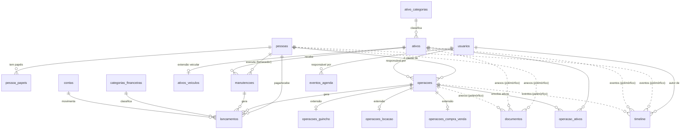

# 02 · Modelo de Dados

> A fonte única de verdade do HallaxOS. Toda entidade existe **uma vez**.
> Convenções gerais (UUID v7, timestamps, soft delete, numeric para dinheiro)
> estão no doc 01 e valem para todas as tabelas abaixo.

## Diagrama (DER)

---

## 1. Pessoas

Cadastro **único** de qualquer pessoa física ou jurídica que se relaciona com
a Hallax. Cliente, fornecedor, motorista e parceiro **não são tabelas** — são
papéis sobre o mesmo cadastro. Uma oficina que vira cliente de locação
continua sendo o mesmo registro, com a história inteira preservada.

### `pessoas`

| Campo                 | Tipo            | Notas                                        |
| --------------------- | --------------- | -------------------------------------------- |
| id                    | uuid PK         |                                              |
| tipo                  | enum            | `pf` \| `pj`                                 |
| nome                  | text            | Nome completo ou razão social                |
| nome_fantasia         | text NULL       | Só PJ                                        |
| cpf_cnpj              | text UNIQUE     | Normalizado (só dígitos)                     |
| email                 | text NULL       |                                              |
| telefone              | text NULL       | Principal (WhatsApp)                         |
| telefone_secundario   | text NULL       |                                              |
| cep / logradouro / numero / complemento / bairro / cidade / uf | text NULL | Endereço embutido — um endereço por pessoa é suficiente hoje |
| cnh_numero            | text NULL       | Só preenchido para quem dirige               |
| cnh_categoria         | text NULL       |                                              |
| cnh_validade          | date NULL       | Alimenta alertas da agenda                   |
| observacoes           | text NULL       |                                              |
| created_at / updated_at / deleted_at |  |                                              |

### `pessoa_papeis`

| Campo     | Tipo | Notas                                                                 |
| --------- | ---- | --------------------------------------------------------------------- |
| pessoa_id | FK   | PK composto com `papel`                                              |
| papel     | enum | `cliente` \| `fornecedor` \| `motorista` \| `parceiro` \| `oficina` |

> Papéis são atribuídos automaticamente pelo sistema quando a pessoa participa
> de algo (virou cliente ao fechar a primeira operação) — o usuário não
> precisa "decidir o tipo" no cadastro. Busca antes de cadastro: o fluxo de
> criar operação sempre busca a pessoa primeiro e só então oferece criar.
>
> **Oficina** é o único papel marcado manualmente (campo "É oficina" no
> cadastro, normalmente PJ): a oficina/prestador de manutenção **é uma pessoa**
> (doc 02 §5, `manutencoes.fornecedor_id`), não uma tabela nova. Marcar como
> oficina a torna pesquisável e filtrável (`GET /pessoas?papel=oficina`),
> alimentando o autocomplete de oficina nas manutenções.

---

## 2. Ativos

**Tudo que é patrimônio da Hallax** — do caminhão guincho à cama elástica.
O núcleo é genérico; veículos ganham extensão 1:1.

### `ativo_categorias`

| Campo              | Tipo    | Notas                                            |
| ------------------ | ------- | ------------------------------------------------ |
| id                 | uuid PK |                                                  |
| nome               | text    | Carro, Caminhão Guincho, Empilhadeira, Móvel...  |
| eh_veicular        | bool    | Se `true`, o ativo exige a extensão `ativos_veiculos` |

### `ativos`

| Campo            | Tipo          | Notas                                                  |
| ---------------- | ------------- | ------------------------------------------------------ |
| id               | uuid PK       |                                                        |
| codigo           | text UNIQUE   | `AT-0001` — sequencial amigável                        |
| categoria_id     | FK            |                                                        |
| nome             | text          | "Corolla Prata 2022", "Empilhadeira Yale"              |
| status           | enum          | ver doc 03 (máquina de estados)                        |
| valor_aquisicao  | numeric NULL  |                                                        |
| data_aquisicao   | date NULL     |                                                        |
| localizacao      | text NULL     | Pátio, filial, "com cliente"...                        |
| observacoes      | text NULL     |                                                        |
| timestamps + deleted_at |        | Ativo vendido **não é deletado** — vira status `vendido` |

### `ativos_veiculos` (extensão 1:1)

| Campo          | Tipo        | Notas                                      |
| -------------- | ----------- | ------------------------------------------ |
| ativo_id       | PK + FK     |                                            |
| placa          | text UNIQUE |                                            |
| renavam        | text NULL   |                                            |
| chassi         | text NULL   |                                            |
| marca / modelo | text        |                                            |
| ano_fabricacao / ano_modelo | int |                                       |
| cor            | text NULL   |                                            |
| combustivel    | enum NULL   | `gasolina` \| `etanol` \| `flex` \| `diesel` \| `eletrico` \| `hibrido` |
| km_atual       | int         | Atualizado por locações e manutenções      |

---

## 3. Operações

O coração do sistema. **Uma** tabela núcleo + extensões por tipo (justificativa no doc 01).

### `operacoes`

| Campo          | Tipo        | Notas                                              |
| -------------- | ----------- | -------------------------------------------------- |
| id             | uuid PK     |                                                    |
| codigo         | text UNIQUE | `OP-0001`                                          |
| tipo           | enum        | `guincho` \| `locacao` \| `venda` \| `compra`      |
| cliente_id     | FK pessoas  | Na compra, é o vendedor — a contraparte da Hallax  |
| responsavel_id | FK usuarios | Quem conduz a operação                             |
| status         | enum        | ver doc 03 — estados variam por tipo               |
| valor_total    | numeric     |                                                    |
| desconto       | numeric     | default 0                                          |
| data_inicio    | timestamptz |                                                    |
| data_fim       | timestamptz NULL |                                               |
| observacoes    | text NULL   |                                                    |
| timestamps + deleted_at |    |                                                    |

### `operacao_ativos` (N:N)

Quais ativos participam da operação e em qual papel.

| Campo       | Tipo | Notas                                                            |
| ----------- | ---- | ---------------------------------------------------------------- |
| operacao_id | FK   | PK composto com `ativo_id`                                       |
| ativo_id    | FK   |                                                                  |
| papel       | enum | `objeto` (o que está sendo alugado/vendido) \| `recurso` (o caminhão usado no guincho) |

> No guincho, o veículo **do cliente** não é um ativo nosso — seus dados vivem
> na extensão `operacoes_guincho` como texto, sem poluir o patrimônio.
>
> `origem_endereco` / `destino_endereco` são **texto livre por natureza**: o
> local de um guincho é um evento (onde o carro está), raramente o endereço
> cadastrado do cliente. A UI oferece o atalho "Usar endereço do cliente", que
> **preenche** o campo a partir do endereço da `pessoa` (núcleo) — um snapshot
> de conveniência, não uma tabela paralela. A fonte de verdade do endereço
> continua sendo `pessoas`; hoje é um endereço por pessoa (§1).

### `operacoes_guincho` (extensão 1:1)

| Campo                     | Tipo            | Notas                              |
| ------------------------- | --------------- | ---------------------------------- |
| operacao_id               | PK + FK         |                                    |
| motorista_id              | FK pessoas NULL |                                    |
| origem_endereco           | text            |                                    |
| destino_endereco          | text            |                                    |
| veiculo_cliente_descricao | text            | "Fiat Uno cinza"                   |
| veiculo_cliente_placa     | text NULL       |                                    |
| km_percorrido             | int NULL        |                                    |
| data_acionamento          | timestamptz     |                                    |
| data_conclusao            | timestamptz NULL |                                   |

### `operacoes_locacao` (extensão 1:1)

| Campo                   | Tipo            | Notas                                  |
| ----------------------- | --------------- | -------------------------------------- |
| operacao_id             | PK + FK         |                                        |
| condutor_id             | FK pessoas NULL | Default: o próprio cliente             |
| valor_diaria            | numeric         |                                        |
| caucao                  | numeric         | default 0                              |
| data_retirada           | timestamptz NULL |                                       |
| data_devolucao_prevista | timestamptz     |                                        |
| data_devolucao_real     | timestamptz NULL |                                       |
| km_saida / km_retorno   | int NULL        | Ao devolver, atualiza `ativos_veiculos.km_atual` |

### `operacoes_compra_venda` (extensão 1:1, serve aos dois tipos)

| Campo                | Tipo      | Notas                                        |
| -------------------- | --------- | -------------------------------------------- |
| operacao_id          | PK + FK   | O sentido (compra/venda) está em `operacoes.tipo` |
| km_no_ato            | int NULL  |                                              |
| data_transferencia   | date NULL | Transferência de documento                   |
| status_documentacao  | enum      | `pendente` \| `em_andamento` \| `concluida`  |

---

## 4. Financeiro

### `lancamentos`

Toda movimentação financeira. **Origem rastreável é obrigatória por design**:
no máximo uma origem (`operacao_id` ou `manutencao_id`), garantida por CHECK.
Sem origem = lançamento avulso (aluguel do galpão, conta de luz).

`ativo_id` é um eixo **separado** da origem: vínculo de **classificação que
coexiste** (decisão #53). Serve para o custo **direto** de um ativo que não é
operação nem manutenção — IPVA, seguro, multa. Como coexiste, o CHECK de origem
única **não muda**: um lançamento pode ter `operacao_id` **e** `ativo_id`
(marcar o ativo de um lançamento de operação), ou só `ativo_id` (custo avulso do
ativo), ou nenhum. O resultado financeiro/ROI do ativo (doc 03 / relatórios)
soma os lançamentos **diretos** (`ativo_id`) **+** os **herdados** (via
operação-objeto e manutenção) — consulta, nunca cópia.

| Campo            | Tipo             | Notas                                              |
| ---------------- | ---------------- | -------------------------------------------------- |
| id               | uuid PK          |                                                    |
| tipo             | enum             | `receita` \| `despesa`                             |
| descricao        | text             |                                                    |
| categoria_id     | FK categorias_financeiras |                                           |
| conta_id         | FK contas        |                                                    |
| pessoa_id        | FK pessoas NULL  | Quem paga / quem recebe                            |
| operacao_id      | FK NULL          | Origem (CHECK: no máximo uma origem preenchida)    |
| manutencao_id    | FK NULL          | Origem                                             |
| ativo_id         | FK ativos NULL   | **Classificação** que coexiste com a origem (decisão #53): custo direto do ativo (IPVA, seguro, multa) e/ou marcação do ativo num lançamento de operação/manutenção. **Não** é origem — não dispara geração e não entra no CHECK de origem única |
| valor            | numeric(12,2)    | Sempre positivo; o sinal vem de `tipo`             |
| data_vencimento  | date             |                                                    |
| data_pagamento   | date NULL        | Preenchida = pago                                  |
| status           | enum             | `previsto` \| `pago` \| `cancelado` — `vencido` é **derivado** (previsto + vencimento no passado), nunca gravado. **Anular** um lançamento lançado errado reusa `cancelado` (sem contrapartida) e preserva o vínculo de origem (doc 03 regra 6) |
| forma_pagamento  | enum NULL        | `dinheiro` \| `pix` \| `cartao_credito` \| `cartao_debito` \| `boleto` \| `transferencia` |
| parcela_numero / parcela_total | int NULL | Parcelamento                            |
| grupo_parcelas_id | uuid NULL       | Agrupa parcelas da mesma origem                    |
| timestamps + deleted_at |           |                                                    |

### `categorias_financeiras`

| Campo | Tipo    | Notas                                                  |
| ----- | ------- | ------------------------------------------------------ |
| id    | uuid PK |                                                        |
| nome  | text    | Locação, Guincho, Manutenção, Combustível, Impostos... |
| tipo  | enum    | `receita` \| `despesa`                                 |

### `contas`

| Campo         | Tipo    | Notas                                  |
| ------------- | ------- | -------------------------------------- |
| id            | uuid PK |                                        |
| nome          | text    | "Caixa", "Banco Inter PJ"...           |
| saldo_inicial | numeric | Saldo atual é **derivado** dos lançamentos pagos — nunca armazenado |

---

## 5. Manutenções

### `manutencoes`

| Campo         | Tipo            | Notas                                              |
| ------------- | --------------- | -------------------------------------------------- |
| id            | uuid PK         |                                                    |
| ativo_id      | FK              | Qualquer ativo, não só veículos                    |
| tipo          | enum            | `preventiva` \| `corretiva` \| `revisao` \| `melhoria` |
| status        | enum            | ver doc 03                                         |
| descricao     | text            |                                                    |
| fornecedor_id | FK pessoas NULL | A oficina/prestador — é uma pessoa, claro          |
| data_agendada | date NULL       | Alimenta a agenda                                  |
| data_inicio / data_conclusao | timestamptz NULL |                              |
| km_no_momento | int NULL        | Só veículos; atualiza `km_atual`                   |
| observacoes   | text NULL       |                                                    |
| timestamps + deleted_at |       |                                                    |

> **Custo da manutenção não é uma coluna.** É a soma dos `lancamentos` com
> `manutencao_id` apontando para ela. Um número, um lugar.

---

## 6. Documentos

Anexos de qualquer entidade (CRLV do veículo, contrato da locação, CNH do
cliente, NF da manutenção). Usa a **referência transversal** — exceção
aprovada de arquitetura, formalizada no doc 04 §0, que define o enum
compartilhado `referencia_entidade`, a lista fechada de tabelas autorizadas e
como a camada de aplicação garante a integridade (validação em transação,
soft delete nos alvos, job detector de órfãos).

### `documentos`

| Campo         | Tipo        | Notas                                                   |
| ------------- | ----------- | ------------------------------------------------------- |
| id            | uuid PK     |                                                         |
| entidade_tipo | enum        | `pessoa` \| `ativo` \| `operacao` \| `manutencao` \| `lancamento` |
| entidade_id   | uuid        |                                                         |
| tipo          | enum        | `contrato` \| `crlv` \| `cnh` \| `nota_fiscal` \| `foto` \| `comprovante` \| `outro` |
| nome          | text        |                                                         |
| arquivo_path  | text        | Caminho no storage                                      |
| mime_type     | text        |                                                         |
| tamanho_bytes | int         |                                                         |
| data_validade | date NULL   | CRLV, CNH, seguro → alimenta alertas da agenda          |
| usuario_id    | FK usuarios | Quem anexou                                             |
| timestamps + deleted_at |   | Soft delete por padrão. Anexo no lugar errado (foto em ativo errado) admite **exclusão permanente**: hard delete real do arquivo + linha — anexo não é origem de nada, não há vínculo a preservar (doc 06: `DELETE /documentos/:id?permanente=true`) |

---

## 7. Usuários

Quem opera o sistema (diferente de `pessoas`, que é com quem a Hallax se relaciona).

### `usuarios`

| Campo         | Tipo        | Notas                                           |
| ------------- | ----------- | ----------------------------------------------- |
| id            | uuid PK     |                                                 |
| nome          | text        |                                                 |
| email         | text UNIQUE | Login                                           |
| senha_hash    | text        | argon2id                                        |
| papel         | enum        | `admin` \| `gestor` \| `operador` \| `financeiro` (detalhado na etapa de permissões) |
| ativo         | bool        | Desativar, nunca deletar — preserva a autoria na timeline |
| ultimo_acesso | timestamptz NULL |                                            |
| timestamps    |             |                                                 |

---

## 8. Agenda

Eventos manuais. Os eventos **derivados** (devolução de locação prevista,
CNH/CRLV vencendo, manutenção agendada, lançamento vencendo) **não são
gravados aqui** — são uma view sobre os dados de origem. Gravar cópias criaria
exatamente a duplicação que a regra máxima proíbe.

### `eventos_agenda`

| Campo                       | Tipo             | Notas                            |
| --------------------------- | ---------------- | -------------------------------- |
| id                          | uuid PK          |                                  |
| titulo                      | text             |                                  |
| descricao                   | text NULL        |                                  |
| data_inicio / data_fim      | timestamptz      |                                  |
| dia_inteiro                 | bool             |                                  |
| responsavel_id              | FK usuarios NULL |                                  |
| entidade_tipo / entidade_id | NULL             | Vínculo opcional a qualquer registro |
| concluido                   | bool             |                                  |
| timestamps + deleted_at     |                  |                                  |

---

## 9. Timeline

A memória do sistema. **Append-only**: sem UPDATE, sem DELETE, nunca.
Serve de timeline de negócio (visível ao usuário) e de auditoria (diffs em `dados`)
— uma tabela, os dois usos, zero duplicação.

### `timeline`

| Campo         | Tipo             | Notas                                                |
| ------------- | ---------------- | ---------------------------------------------------- |
| id            | uuid PK          |                                                      |
| entidade_tipo | enum             | `referencia_entidade` (doc 04 §0)                    |
| entidade_id   | uuid             |                                                      |
| evento        | enum             | `criado` \| `atualizado` \| `status_alterado` \| `comentario_adicionado` \| `documento_anexado` \| `lancamento_gerado` \| `login` \| `logout` \| `login_falhou` |
| descricao     | text             | Legível por humanos: "Locação ativada — Corolla retirado com 45.230 km" |
| dados         | jsonb NULL       | Diff estruturado: `{campo: {de, para}}` — auditoria e consumo por IA |
| usuario_id    | FK usuarios NULL | NULL = ação automática do sistema                    |
| created_at    | timestamptz      | (sem updated_at — imutável)                          |

> A timeline de um **ativo** mostra mais que seus próprios eventos: agrega as
> operações e manutenções em que ele participou. Isso é feito por consulta,
> não por cópia.

---

## 10. Serviços transversais

As tabelas `comentarios`, `tags`, `tags_vinculos`, `favoritos`, `notificacoes`,
`busca_indice` e `sessoes` completam o modelo e estão definidas onde são
explicadas — doc 04 (serviços transversais) e doc 05 (sessões). Cada tabela do
sistema é definida em exatamente um documento.

## O que NÃO existe (de propósito)

| Tentação                          | Por que não                                                       |
| --------------------------------- | ----------------------------------------------------------------- |
| Tabela `clientes` e `fornecedores`| São papéis de `pessoas` — uma pessoa, um cadastro                 |
| Tabela `veiculos` independente    | Veículo é `ativo` + extensão — patrimônio é um conceito só        |
| Tabelas por módulo (`alugueis`, `guinchos`) com cliente/valor/status próprios | É a duplicação que a regra máxima proíbe — tudo é `operacoes` |
| Coluna `saldo` na conta           | Derivado dos lançamentos — saldo nunca diverge do extrato         |
| Coluna `custo_total` na manutenção| Derivado dos lançamentos vinculados                               |
| Status `vencido` gravado          | Derivado de `status + data_vencimento` — nunca fica obsoleto      |
| Tabelas de dashboard/relatório    | São consultas sobre o núcleo                                      |
